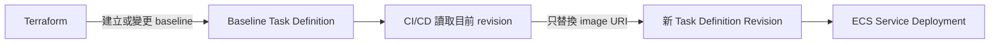

# ADR-002：Terraform 與 CI/CD 的 ECS Ownership

- 狀態：Accepted
- 日期：2026-10-05

## 背景

M5 的 Terraform 同時管理 ECS service 與 baseline task definition。M6 必須使用 Git commit SHA 作為 immutable image tag 進行部署，但不能每次應用程式發版都執行 `terraform apply`。如果 Terraform 與 CI/CD 同時管理 service 的 task-definition pointer，後續的 Terraform apply 可能把已成功部署的版本退回舊 revision。

## 決策

Terraform 負責 ECR、ECS infrastructure、service configuration、IAM、networking，以及 baseline task definition。GitHub Actions 複製 service 當下使用的 task definition，只替換 Order Service image，接著註冊新 revision 並更新 service pointer。Terraform 只忽略 `aws_ecs_service.order.task_definition` 的 drift。

CPU、memory、ports、secrets 或 roles 等 runtime configuration 若需改變，必須先透過 Terraform 建立新的 baseline。CI/CD 不是 infrastructure pipeline。

## 分工示意

| 負責者 | 可以變更的內容 |
|---|---|
| Terraform | Baseline task definition：CPU、memory、ports、environment variables、secrets、IAM roles、log configuration 與其他 runtime settings |
| CI/CD | Application image URI：以 Git commit SHA image 建立新 revision，並將 ECS service 更新至該 revision |

簡而言之：**要改 baseline task definition，就修改 Terraform；CI/CD 僅更新 image，不自行改動其他 task definition 設定。**

## 影響

- Application release 可以從 commit SHA 追溯至 ECR image 與 ECS revision。
- Terraform 不會再將 service 退回舊的 application revision。
- Task runtime configuration 變更時，operator 必須刻意建立新的 Terraform baseline。
- Rollback 選擇已知正常、使用 immutable image 的 task-definition revision；不使用 `latest`。
